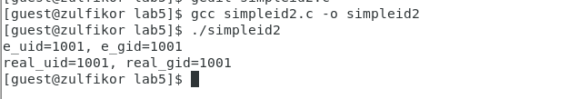
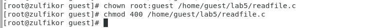
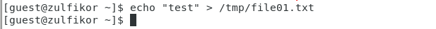
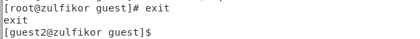
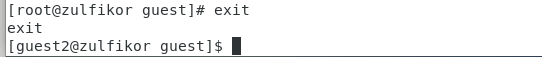

---
## Front matter
lang: ru-RU
title: Лабораторная работа №5
author: |
	 Аминов Зулфикор\inst{1}

institute: |
	\inst{1}Российский Университет Дружбы Народов

date: 8.10, 2022, Москва, Россия

## Formatting
mainfont: PT Serif
romanfont: PT Serif
sansfont: PT Sans
monofont: PT Mono
toc: false
slide_level: 2
theme: metropolis
header-includes: 
 - \metroset{progressbar=frametitle,sectionpage=progressbar,numbering=fraction}
 - '\makeatletter'
 - '\beamer@ignorenonframefalse'
 - '\makeatother'
aspectratio: 43
section-titles: true

---

# Цели и задачи работы

## Цель лабораторной работы

Изучение механизмов изменения идентификаторов, применения
SetUID- и Sticky-битов. Получение практических навыков работы в
консоли с дополнительными атрибутами. Рассмотрение работы механизма
смены идентификатора процессов пользователей, а также влияние бита
Sticky на запись и удаление файлов.

# Выполнение работы

## Вошли в систему от имени пользователя guest

Создали файл simpleid.c:

{ #fig:001 width=100% height=100% }

{ #fig:002 width=100% height=100% }

## Скомплилировали программу

{ #fig:003 width=100% height=100% }

## Запустили программу simpleid

{ #fig:004 width=100% height=100% }

## Выполнили системную программу id

{ #fig:005 width=100% height=100% }

## Создали файл simpleid2.c

{ #fig:006 width=100% height=100% }

{ #fig:007 width=100% height=100% }

## Скомпилировали и запустили simpleid2.c

{ #fig:008 width=100% height=100% }

## От имени суперпользователя выполнили команды

{ #fig:009 width=100% height=100% }

## Выполнили проверку правильности установки новых атрибутов и смены владельца файла simpleid2

{ #fig:010 width=100% height=100% }

## Запустили simpleid2 и id:

{ #fig:011 width=100% height=100% }

## Создали файл readfile.c

{ #fig:012 width=100% height=100% }

{ #fig:013 width=100% height=100% }

## Откомпилировали программу

{ #fig:014 width=100% height=100% }

## Сменили владельца у файла readfile.c и измените права так, чтобы только суперпользователь (root) мог прочитать его, a guest не мог

{ #fig:015 width=100% height=100% }

## Проверили, что пользователь guest не может ли прочитать файл readfile.c.

{ #fig:016 width=100% height=100% }

## Сменили у программы readfile владельца и установите SetU’D-бит

{ #fig:017 width=100% height=100% }

{ #fig:018 width=100% height=100% }

## Проверка, может ли программа readfile прочитать файл readfile.c?

{ #fig:019 width=100% height=100% }

## Проверили, может ли программа readfile прочитать файл /etc/shadow

{ #fig:020 width=100% height=100% }

# Исследование Sticky-бита

## Выяснили, установлен ли атрибут Sticky на директории /tmp

{ #fig:021 width=100% height=100% }

## От имени пользователя guest создали файл file01.txt в директории /tmp со словом test

{ #fig:022 width=100% height=100% }

## Просмотрели атрибуты у только что созданного файла и разрешили чтение и запись для категории пользователей «все остальные»

{ #fig:023 width=100% height=100% }

## От пользователя guest2 попробовали прочитать файл /tmp/file01.txt

{ #fig:024 width=100% height=100% }

## От пользователя guest2 попробовали дозаписать в файл /tmp/file01.txt слово test2

{ #fig:025 width=100% height=100% }

## Проверили содержимое файла

{ #fig:026 width=100% height=100% }

## От пользователя guest2 попробовали записать в файл /tmp/file01.txt слово test3, стерев при этом всю имеющуюся в файле информацию

{ #fig:027 width=100% height=100% }

## Проверили содержимое файла

{ #fig:028 width=100% height=100% }

## От пользователя guest2 попробовали удалить файл /tmp/file01.txt

{ #fig:029 width=100% height=100% }

## От имени суперпользователя снимали атрибут t (Sticky-бит) с директории /tmp

{ #fig:030 width=100% height=100% }

## Покинули режим суперпользователя

{ #fig:031 width=100% height=100% }

## От пользователя guest2 проверили, что атрибута t у директории /tmp нет

{ #fig:032 width=100% height=100% }

## Повторили предыдущие шаги

{ #fig:033 width=100% height=100% }

## Не удалось удалить файл от имени пользователя

{ #fig:034 width=100% height=100% }

# Выводы по проделанной работе

## Выводы

Изучили механизмов изменения идентификаторов, применения
SetUID- и Sticky-битов. Получили практических навыков работы в
консоли с дополнительными атрибутами. Рассмотрели работы механизма
смены идентификатора процессов пользователей.
