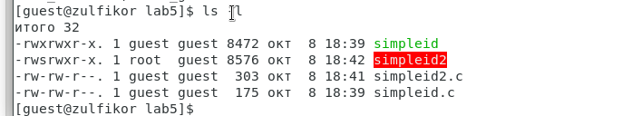
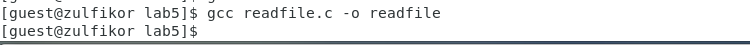
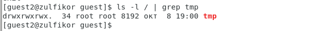

---
# Front matter
title: "Отчёт по лабораторной работе №5"
subtitle: "Дискреционное разграничение прав в Linux. Исследование влияния дополнительных атрибутов"
author: "Аминов Зулфикор Мирзокаримович"

# Generic otions
lang: ru-RU
toc-title: "Содержание"

# Bibliography
bibliography: bib/cite.bib
csl: pandoc/csl/gost-r-7-0-5-2008-numeric.csl

# Pdf output format
toc: true # Table of contents
toc_depth: 2
fontsize: 12pt
linestretch: 1.5
papersize: a4
documentclass: scrreprt
## I18n
polyglossia-lang:
  name: russian
  options:
	- spelling=modern
	- babelshorthands=true
polyglossia-otherlangs:
  name: english
### Fonts
mainfont: PT Serif
romanfont: PT Serif
sansfont: PT Sans
monofont: PT Mono
mainfontoptions: Ligatures=TeX
romanfontoptions: Ligatures=TeX
sansfontoptions: Ligatures=TeX,Scale=MatchLowercase
monofontoptions: Scale=MatchLowercase,Scale=0.9
## Biblatex
biblatex: true
biblio-style: "gost-numeric"
biblatexoptions:
  - parentracker=true
  - backend=biber
  - hyperref=auto
  - language=auto
  - autolang=other*
  - citestyle=gost-numeric
## Misc options
indent: true
header-includes:
  - \linepenalty=10 # the penalty added to the badness of each line within a paragraph (no associated penalty node) Increasing the value makes tex try to have fewer lines in the paragraph.
  - \interlinepenalty=0 # value of the penalty (node) added after each line of a paragraph.
  - \hyphenpenalty=50 # the penalty for line breaking at an automatically inserted hyphen
  - \exhyphenpenalty=50 # the penalty for line breaking at an explicit hyphen
  - \binoppenalty=700 # the penalty for breaking a line at a binary operator
  - \relpenalty=500 # the penalty for breaking a line at a relation
  - \clubpenalty=150 # extra penalty for breaking after first line of a paragraph
  - \widowpenalty=150 # extra penalty for breaking before last line of a paragraph
  - \displaywidowpenalty=50 # extra penalty for breaking before last line before a display math
  - \brokenpenalty=100 # extra penalty for page breaking after a hyphenated line
  - \predisplaypenalty=10000 # penalty for breaking before a display
  - \postdisplaypenalty=0 # penalty for breaking after a display
  - \floatingpenalty = 20000 # penalty for splitting an insertion (can only be split footnote in standard LaTeX)
  - \raggedbottom # or \flushbottom
  - \usepackage{float} # keep figures where there are in the text
  - \floatplacement{figure}{H} # keep figures where there are in the text
---

# Цель работы

Изучение механизмов изменения идентификаторов, применения
SetUID- и Sticky-битов. Получение практических навыков работы в
консоли с дополнительными атрибутами. Рассмотрение работы механизма
смены идентификатора процессов пользователей, а также влияние бита
Sticky на запись и удаление файлов.

# Выполнение работы

Вошли в систему от имени пользователя guest

Создали файл simpleid.c:

{ #fig:001 width=100% height=100% }

{ #fig:002 width=100% height=100% }

Скомплилировали программу

{ #fig:003 width=100% height=100% }

Запустили программу simpleid

{ #fig:004 width=100% height=100% }

Выполнили системную программу id

{ #fig:005 width=100% height=100% }

Создали файл simpleid2.c

{ #fig:006 width=100% height=100% }

{ #fig:007 width=100% height=100% }

Скомпилировали и запустили simpleid2.c

{ #fig:008 width=100% height=100% }

От имени суперпользователя выполнили команды

{ #fig:009 width=100% height=100% }

Выполнили проверку правильности установки новых атрибутов и смены
владельца файла simpleid2

{ #fig:010 width=100% height=100% }

Запустили simpleid2 и id:

{ #fig:011 width=100% height=100% }

Создали файл readfile.c

{ #fig:012 width=100% height=100% }

{ #fig:013 width=100% height=100% }

Откомпилировали программу

{ #fig:014 width=100% height=100% }

Сменили владельца у файла readfile.c и измените права так, чтобы только суперпользователь
(root) мог прочитать его, a guest не мог

{ #fig:015 width=100% height=100% }

Проверили, что пользователь guest не может ли прочитать файл readfile.c.

{ #fig:016 width=100% height=100% }

Сменили у программы readfile владельца и установите SetU’D-бит

{ #fig:017 width=100% height=100% }

{ #fig:018 width=100% height=100% }

Проверка, может ли программа readfile прочитать файл readfile.c?

{ #fig:019 width=100% height=100% }

Проверили, может ли программа readfile прочитать файл /etc/shadow

{ #fig:020 width=100% height=100% }

## Исследование Sticky-бита

Выяснили, установлен ли атрибут Sticky на директории /tmp

{ #fig:021 width=100% height=100% }

От имени пользователя guest создали файл file01.txt в директории /tmp
со словом test

{ #fig:022 width=100% height=100% }

Просмотрели атрибуты у только что созданного файла и разрешили
чтение и запись для категории пользователей «все остальные»

{ #fig:023 width=100% height=100% }

От пользователя guest2 попробовали прочитать файл /tmp/file01.txt

{ #fig:024 width=100% height=100% }

От пользователя guest2 попробовали дозаписать в файл /tmp/file01.txt слово test2

{ #fig:025 width=100% height=100% }

Проверили содержимое файла

{ #fig:026 width=100% height=100% }

От пользователя guest2 попробовали записать в файл /tmp/file01.txt
слово test3, стерев при этом всю имеющуюся в файле информацию

{ #fig:027 width=100% height=100% }

Проверили содержимое файла

{ #fig:028 width=100% height=100% }

От пользователя guest2 попробовали удалить файл /tmp/file01.txt

{ #fig:029 width=100% height=100% }

От имени суперпользователя снимали атрибут t (Sticky-бит) с директории /tmp

{ #fig:030 width=100% height=100% }

Покинули режим суперпользователя

{ #fig:031 width=100% height=100% }

От пользователя guest2 проверили, что атрибута t у директории /tmp нет

{ #fig:032 width=100% height=100% }

Повторили предыдущие шаги

{ #fig:033 width=100% height=100% }

Не удалось удалить файл от имени пользователя

{ #fig:034 width=100% height=100% }

# Выводы

Изучили механизмов изменения идентификаторов, применения
SetUID- и Sticky-битов. Получили практических навыков работы в
консоли с дополнительными атрибутами. Рассмотрели работы механизма
смены идентификатора процессов пользователей.
